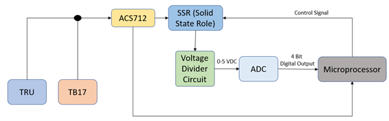
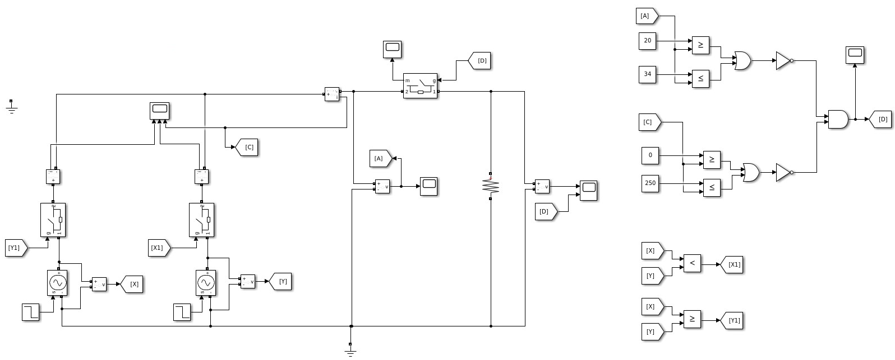
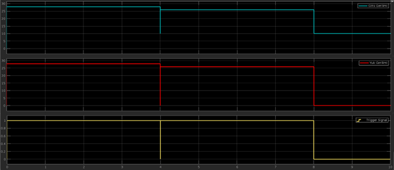
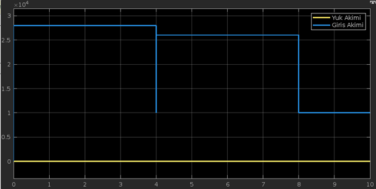
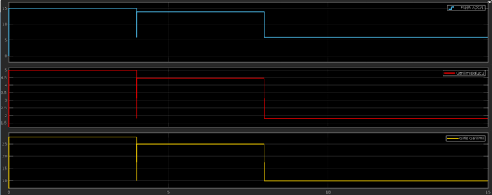
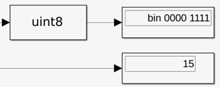
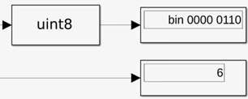

# Avionics Power Distribution & Protection System Simulation 

This project, developed for educational purposes during the engineering program at **Turkish Aerospace Industries (TUSAŞ)**, simulates critical power distribution units (PDU) and protection mechanisms compliant with aviation standards (**DO-160G**, **MIL-STD-704**).

The system models real-world avionics components based on public specifications, including the **Astronics 1434 RTRU** and **True Blue Power TB17 Lithium-ion Battery**.

## 📂 Project Structure
This repository contains two stages of the design process:

### 1. Logic Design Model (`PDU_Logic_Design.slx`)
The conceptual design demonstrating protection algorithms using comparators and logic gates.
* **Features:** Source Switching (OR-ing), Over/Under Voltage Protection, Short Circuit Protection.

### 2. Embedded Implementation Model (`PDU_Embedded_Implementation.slx`)
The hardware-ready adaptation model designed for microcontrollers.
* **ADC Simulation:** Voltage divider scaling (28V -> 5V) for Analog-to-Digital Converter input.
* **Digital Logic:** Simulates binary processing of fault signals as performed by an MCU.

---

## 📊 System Architecture & Hardware
**1. System Overview**
The architecture manages power flow from the Variable Frequency Generator (VFG) to loads, switching between Main TRU and Backup Battery.

**2. Hardware Implementation Plan**
Design layout for Microcontroller, ACS712 Current Sensor, and SSR (Solid State Relay) integration.

---

## 🛠 Simulation Results & Protection Logic

### 1. Logic Protection Circuit
The core decision-making algorithm using AND/OR gates to detect faults based on DO-160G thresholds.

### 2. Voltage Source Switching (OR-ing)
Demonstration of seamless power transition from **Astronics 1434 RTRU (28V)** to **TB17 Battery (26V)** during a failure event.

### 3. Short Circuit Response
System response to a surge current event (>250A), demonstrating immediate breaker activation.

---

## 💻 Embedded Signal Processing (ADC)

**Step 1: Test Scenario**
The system was tested under a failure scenario: Normal Operation (28V) -> Battery Mode (26V) -> Total Failure (10V).

**Step 2: Digital Conversion Analysis**
The ADC converts the scaled analog voltage into digital signals for the MCU.

| Scenario | Input Voltage | ADC Output (Binary) | ADC Output (Hex) | MCU Action |
| :--- | :--- | :--- | :--- | :--- |
| **Normal** | 28 V | `0000 1111` | `0x0F` | Power ON |
| **Fault** | 10 V | `0000 0110` | `0x06` | **CUT-OFF** |

**Visual Proofs:**
* **Normal Operation (28V):**

* **Fault Condition (10V):**

---

## ⚠️ Disclaimer
This project was developed for **educational and simulation purposes** during the "SKY Experience Candidate Engineering Program" at **Turkish Aerospace Industries (TUSAŞ)**.

* The models and simulations are based on public aviation standards (DO-160G, MIL-STD-704) and commercial component datasheets.
* This repository **does not** contain any classified, proprietary, or flight-critical software belonging to TUSAŞ.
* All designs demonstrate the engineering concepts learned during the internship period.